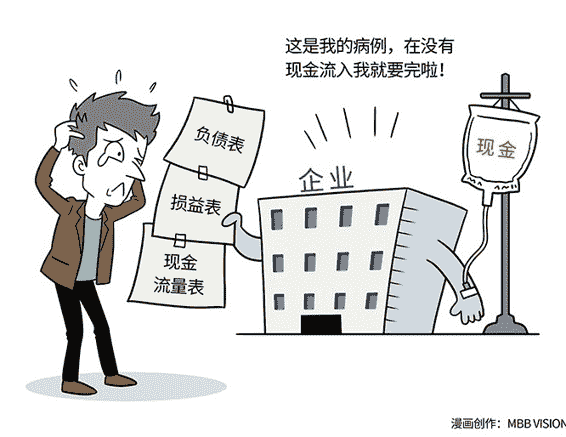

# 118｜能用数字讲故事的三张报表

### 概念：财务报表

我们通常所指的财务报表，不是一张，而是三张：资产负债表，损益表（又叫利润表），和现金流量表。我分别介绍一下。

### 第一，资产负债表。

什么叫资产？公司帐上的现金、短期投资的债权、理财产品、已经交付客户应该付你的钱、库房里的存货、长期投资、拥有的办公楼、车、厂房、生产线、知识产权等等，这些都是公司的资产。

什么是负债？向银行借的钱、欠供应商的应付帐款、客户给你的预付款、公司发行的长期债权等等。

用资产减去负债，就是真正属于你的，叫做所有者权益。

简单吧？给你一个家庭作业，随便找一家上市公司的公告，试着读读看它的资产负债表，理解每一个大项指的是什么意思。

### 第二，损益表，又叫利润表。

损益，也就是利润，等于收入减去费用。

通过损益表，你能看出来：

一家公司的主要收入来自哪里？

主营收入外，有没有投资收益，或者其他营业外收入？

成本结构如何？直接销售费用占比多少？管理费用呢？财务费用呢？

交了多少税？

公司净利润是多少？

简单吧？还是刚才那家上市公司，试着读读看它的损益表，理解每一个大项指的是什么意思。

### 第三，现金流量表。

除了关注公司的资产负债状况，收入费用状况外，必须关注现金，这是公司运营的血液。

现金流量表更简单，就是特定时间段，比如全年公司账面现金的进出，多少现金的流入来自经营、投资、融资？相应又有多少现金流出？进的多，还是出的多？现在公司账上还有多少现金？

### 案例

> 2001年，中央财经大学研究所研究员刘姝威正在写一本名为《上市公司虚假会计报表识别技术》的书，为了写这本书，她对当时一家如日中天的上市公司“蓝田股份”的财务报表进行了分析，得出的结果是，2000年蓝田的流动比率下降到0.77，净营运资金下降到负1.27亿元。翻译成普通话，就是：这家公司没钱还债，是个空壳。

运用：不同“视角”来阅读这三张表

### “流动比率”视角：

回到最开始的“蓝田股份”。刘姝威提到一个词，叫“流动比率”。流动比率就是流动资产，几倍于流动负债。普通话就是：你手上的钱，够还债吗？国际上认为，流动比率为2比较安全。你手上有2块钱，有1块钱短期要还人，比较安全。蓝田的流动比率是0.77，意思是，你欠别人1块钱，但手上只有0.77元。这就很尴尬了。

一旦加上了“视角”，这三张表就有意思了。

### “资产收益率”视角：

我再举个例子，比如“资产收益率”视角，就是用利润除以资产。意思是，你有1块钱资产，一年后赚了3毛，你的资产收益率就是30%。你拿钱赚钱的能力不错，我就愿意投资你。

### “周转天数”视角：

再来个复杂点的视角：周转天数。平均存货余额，乘以360，除以主营业务成本。有点复杂。你就理解为，你进了一批货，几天能卖出去。3天卖出去，比30天卖出去，显然收益好很多，风险小很多。

### 小结：认识财务报表

为什么要懂得阅读资产负债表，损益表，现金流量表？因为这三张财务报表，会用数字讲述企业的经营故事。

怎么看这三张表？要懂得各种阅读视角，比如流动比率，资产收益率，周转天数等等。