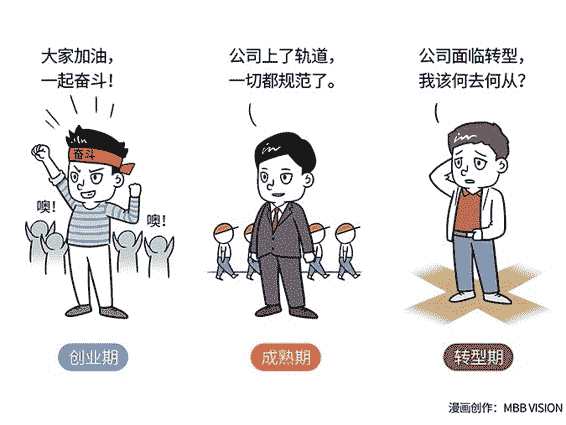

# 126｜向着悬崖狂奔

### 案例

> 你是一名成功的企业家、管理者，媒体把你捧上天了，你什么毫无道理的做法，都能被当成最佳实践。但突然有一天，时代变了，你的企业面临重大挑战。你坚持用自己赖以成功的管理经验力挽狂澜，但越努力越糟糕。很多媒体开始严厉批评你，说你刚愎自用、思想僵化，说你变了。你很气愤，说：我没变，是你们变了。

概念&运用：企业生命周期

那到底是谁变了呢？其实谁都没变。是企业的发展阶段变了。你从“企业生命周期”的成熟期，走向了转型期，而未必自知。

> 什么叫“企业生命周期”？我们把企业的发展分为三个阶段：1）创业期，2）成熟期，3）转型期。

第一阶段，创业期。

创业对绝大多数人来说，是艰难的。未来很不确定，团队也没经验，所以人们说，创业是个九死一生的游戏。在创业期，有两个最重要的工具：战略与管理。很多创业者鄙视管理，觉得那是大机构的官僚体系。战略呢，也只是个朴素的方向。团队最大的竞争力，也许就是一腔热血和百折不挠的精神。在这个阶段，努力非常重要，运气也很重要。我非常赞同雷军说的一句话：不要用战术的勤奋，掩盖战略的懒惰。创业者，要用战略思维，增加好运气。

第二阶段，成熟期。

能走到这一阶段的，值得祝贺。这些企业通常不是“选择了未来”，而是被未来选择。他的战略（朴素的方向）吻合了大时代的方向，加上团队优秀，就走到了成熟期。这时候，很多企业也涨到了200人、500人的规模。创业者终于意识到：哎呀，一个人真是管不过来啊！于是，纷纷开始引入体系化的管理。战略流程化，流程工具化，管理越来越成熟。这既是好事，也是坏事。好的地方是，成功被夯实了；坏的地方是，未来被确定了。在这个阶段，评价你是不是好老板的方法就是你打了一整天的高尔夫球，都没有接到一个电话，厉害，良性经营。出去爬了半年山，公司也不来找你，佩服，大企业家。

第三阶段，转型期。

突然，商业环境巨变，公司的产品不再适合这个时代的用户的需要了，随之，企业的战略和管理都要变，尤其是战略：我们以后到底做什么，往哪里走？这时候，几乎所有爬山的老板都回来了，企业重新进入了二次创业期，也就是转型期。但是，这和创业期不同的是，转型期的企业多背了一个包袱。包袱里虽然是令人羡慕的干粮，但是也让你的步伐更吃力，舍不得丢，也跑不快。怎么办？任正非说：我们要转换，慢慢在人力资源机制中也要形成培养战略家、思想家的土壤。如果找准战略，转型成功，企业会再获新生，进入下一个成熟期，直到，再下一个转型期的来临。这世上没有什么永续经营，所谓的永续经营，就是在每一个重大的转型期，都能够成功转型。认识到“企业生命周期”的存在，并因此认识到，在“企业生命周期”的不同阶段，需要不同的战略思考和管理手段，非常重要。一个真正的企业家，是完整经历过三个阶段的企业家，但大部分人，都成就于第二阶段，衰败于第三阶段。回到最一开始的案例上。你带领你的企业，从创业期，走到成熟期，获得万众瞩目的辉煌，功成名就，所以你对自己的管理方法的正确性，坚信不疑。但是，你现在进入了转型期，在这个阶段，用成熟期的管理方法管理转型，很有可能就是“向着悬崖狂奔”。

### 小结：认识企业生命周期

我们把企业的发展分为三个阶段：1）创业期，2）成熟期，3）转型期。很多人谈“管理”时，通常默认你是处于成熟期。那么，对创业期、转型期需要什么样的管理呢？我们将用一周的时间与你分享。有了第36周的“企业能量模型”，关联地、整体地看待产品、营销和渠道，和今天的“企业生命周期”，把动态的时间轴也加了进来，我希望你的脑海中，终于建立了一个关联地、整体地、动态的企业观，能系统地看待外部的商业和内部的管理。