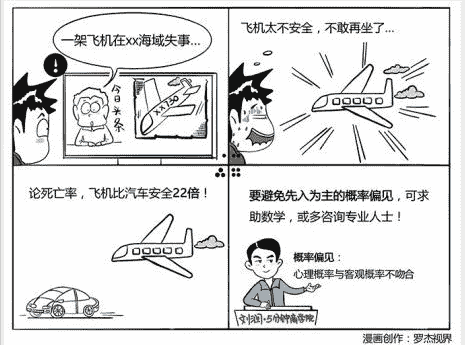

# 019｜全世界一半的娃，都丑到了平均水平以下

### 概念：概率偏见

事实上，我们的直觉和客观概率常常是不相符的。行为经济学家把人类自以为的概率，称之为：心理概率。心理概率，和客观概率的不吻合，就叫做概率偏见。

### 案例

> 你参加一个节目，很幸运获得上台抽奖的机会。台上有A、B、C三个道具门，一辆最新款的特斯拉就在一扇门后，猜对了，车就可以直接开走。

> 每个概率都是三分之一，你选了B（还记得价格锚点里的“避免极端”吗）。这时，主持人打开另外两扇门中的一扇，空的。主持人额外送了你一次改变的机会，问你是坚持选B，还是选另一扇门？

> 你会选择换吗？统计显示，大部分人会选择不换。理由是，现在只有两扇门了，特斯拉在每扇门后的概率应该是50：50，既然选什么都一样，还是相信直觉，坚持第一选择。

> 恭喜大部分人 …… 你们都错了。正确的答案是：换。从B换成另一扇门，抽中特斯拉的概率，会提升一倍。

限于篇幅，就不在这里做数学推理了。数学好的同学，可以在留言区与大家分享你的推导逻辑。很多人一定觉得很惊讶：为什么啊，这和直觉不符呢！

### 归纳：三个原因

诺贝尔经济学奖得主、行为经济学家丹尼尔·卡尼曼认为，这种偏见主要来自于三个原因：

第一、代表性偏差。很拗口的名字，其实就是说：以偏概全。比如，你发现几个好朋友都是双鱼座的，就会觉得，我和双鱼座比较合得来。这也许无伤大雅，但也是以偏概全。你在赌场连赢三把，觉得今天运气真好，如果你因此坚持玩下去，代表性偏差就会请真实的概率，狠狠教训你一顿。

第二、可得性偏差。也是很拗口的名字。我把它称之为：眼见为实。比如，如果飞机失事，必然会引起关注，这时，你多半会觉得飞机很危险。但事实上，论每公里死亡率，坐飞机比坐汽车安全22倍。

第三、沉锚效应。还是很拗口。我叫它：先入为主。也就是说，第一印象，会导致你对一些人的喜好的判断，对一些事的好坏的判断，脱离现实，甚至不可撼动。比如，你第一个男友是渣男，你就会觉得：男人没一个是好东西。

### 小结：如何做出更正确的商业决策？

1、学好数学，尤其是概率与统计。对有办法验证客观概率的，求助数学，不要依靠主观判断。

2、对没有办法验证客观概率的，也不要过于相信自己的主观直觉。问问专业顾问，或者身边更多朋友的建议，用他们的人生经历，对冲你的先入为主。