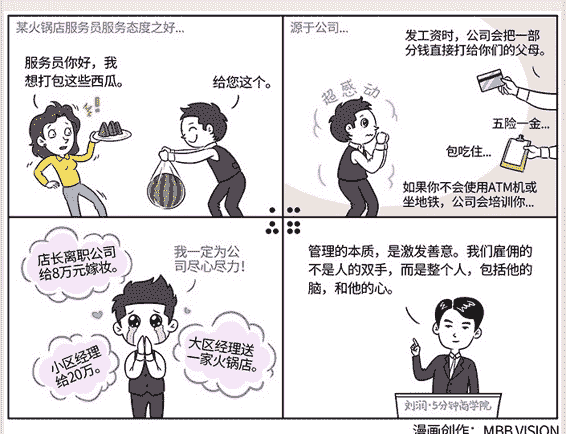

# 066｜尽力来自于本份，尽心来自于善意

在商业篇，我们探讨的问题是，企业如何处理与外部的关系；在管理篇，我们探讨的问题是，企业如何处理与内部的关系。外部的世界很精彩，内部的世界同样精彩，甚至更为复杂，因为我们要面对的主体，不再仅仅是一条条被验证的商业逻辑，我们要面对的主体，是极度不标准化、复杂程度堪比宇宙的：人。

> 所以，我们要和一群“不标准化的、复杂程度堪比宇宙的”人一起，共同去完成一件，任何单独个人都无法完成的使命。

### 概念：激发善意

> 激发善意，就是为了“雇佣整个人”。你从来不可能真正激发一个人，你只能给他一个理由，让他激发自己。

同样工作8小时，能做多少事，和一个人的主观能动性关系巨大。德鲁克认真研究了20年IBM后说：我们不能只雇佣员工的双手，而必须连双手的主人一起雇佣。

### 案例

> 有一家公司，人类都已经无法阻止了。这家公司就叫做：海底捞。江湖上，流传着很多关于海底捞的传说。比如有客人想把没吃完的半盘西瓜打包，海底捞员工给他包了一整个西瓜。真是：我原想收获一缕春风，你却给了我整个春天。

这样的服务，是任何标准流程无法具体规定的。之所以员工能这样想尽方法打动顾客，是因为公司这样想尽方法打动了员工。

海底捞如何打动员工、激发善意？农村孩子来到城市，公司会给他们培训如何使用ATM机，如何坐地铁。发工资时，公司会把一部分钱直接打给他们的父母，让他们也感受这份荣耀。店长离职，就算去了小肥羊，公司都会给这个员工8万元的嫁妆。如果是小区经理，给20万。大区经理，送一家火锅店，等等等等，据说数不胜数。

> 这样对待员工，稍微有点感恩之心的员工，能没有“善意”吗？大家绞尽脑汁，出工、出力、出活。海底捞有近万名员工，流动率保持在10%左右，而中国餐饮业的平均流动率为28.6%。

### 运用：案例

案例1：京东刘强东

比如刘强东。身价300亿的他，每年都要选个日子，与库管、配送人员一起吃果冻，再用果冻杯喝白酒。甚至，他还要找一天，亲自送货。据说有次视察员工宿舍，他怒了：我们的员工怎么能住这种地方。

案例2：顺丰王卫

比如顺丰的王卫。他的快递员不小心把一辆车刮了，司机下车又打又骂，在网上引起众怒。王卫公开说：我王卫向着所有的朋友声明，如果这事我不追究到底，我不再配做顺丰总裁！

案例3：美国西南航空

美国911事件后，航空业面临前所未有的灾难。虽然管理者们口头上喊“员工是企业的最大资产”，但他们迅速裁员，砍掉近10万的“最大资产”。可是，西南航空公司决定，虽然每天亏损三四百万美元，但坚持避免裁员。西南航空的决定，感动了员工，激发了善意。他们更努力地工作，提出很多降低成本的建议。甚至，有的员工将自己的红利和部分工资捐给公司，还有的员工在退税支票上签字，直接将钱转到公司名下。

### 尽力来自于本份，尽心则来自于善意。

#### 小结：管理的本质是什么？

今天是第二季度“管理篇”的第一课。我们从一个基本的问题开始：管理的本质到底是什么？是更科学的流程，还是更团结的心？

> 现代管理学之父，彼得·德鲁克认为，管理的本质，是激发善意。我们雇佣的不是人的双手，而是整个人，包括他的脑，和他的心。

关于如何激发善意，很多管理学者有很多的研究，比如马斯洛的需求理论，赫兹伯格的双因素理论等等，我们将用一周的时间，详细讲述。