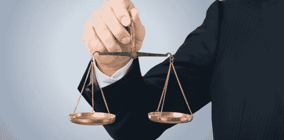
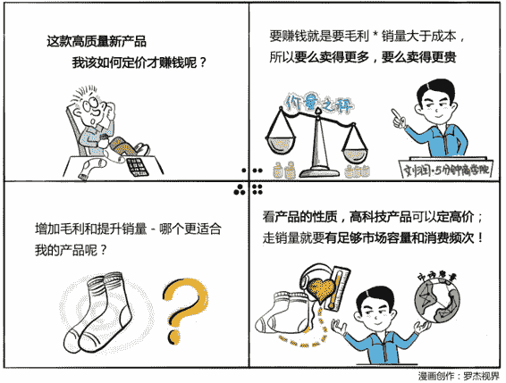

# 008｜该把货卖得更贵，还是卖得更多？

### 概念：价量之秤

一个公司的存在，是以有利润为前提的，只要商品的毛利乘上销量大于这个经营成本，这家公司就是赚钱的。怎么做呢？

1、尽量提高每件商品的毛利率；

2、扩大这个商品的销量。

> 通俗来说，就是卖得更贵，或者卖得更多。

### 案例

这世上有一个行业，把所有的砝码，都加在了卖得更贵的那边，奢侈品行业。

曾经有一则消息称，北京新光天地某著名奢侈品专卖店遭遇失窃，其店长报警说，一个价值2万多的包被偷了，但是最后警方并没有刑事立案，因为那个包的进价也就几百块钱。

使用同样逻辑的还有钻石行业。曾经有一位消费者，拿着他花了10万块钱买来的钻石到典当行去典当，结果典当行只给出了2万多的估价。

### 运用：销量行业

应用场景1: 好市多（Costco）

> 在美国，有一家非常大的连锁会员超市叫做好市多（Costco），商场挺大，但是里面的品类很少，每一个品类的商品都是他的老板亲自挑选，这就导致每一件商品的销量都巨大无比，所以能够跟厂家去拿更便宜的特价。它所有商品的加价率大概是6%或者7%，最高不超过14%。

应用场景2: 小米充电宝

> 一款很高品质的电芯，加上很好工艺的铝合金外壳的充电宝，零售价69块，相当于当时市场价格的1/3。把砝码加到了价量之秤的极端之后，给小米造成了巨大的收益，据说这款充电宝卖了将近5000万支。

### 小结：该卖得更贵，还是卖得更多？

在这里我想给大家3点建议：

第一，要根据这个产品的性质来判断。比如，以情感为主、以不可替代的技术为主的产品，你可以考虑把手上这些有限的砝码，放在提高价格这一端。

第二，当你选择销量为商品模式的时候，你一定要确认这个市场，是不是有足够的容量以及足够的消费频次。也就是说，确认更低的价格，确实会带来更大的销量的提升。

第三，当你要选择毛利为商品模式的时候，你也要确认支撑这个价格的品牌溢价，是不是已经为消费者所接受。

* * *

> 练练手: 假如说你能用比较低的成本生产出高品质的袜子，你是打算把袜子卖得更贵，还是卖得更多。为什么？

* * *

今天是你在这里学的第8天，期待你的进步。