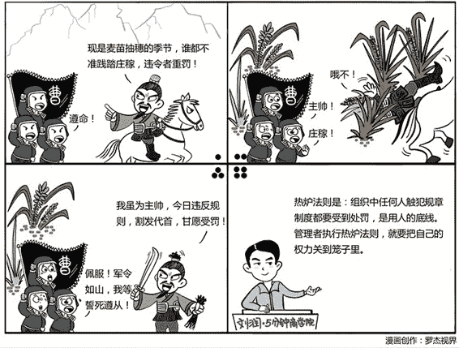

# 093｜把自己的权力关进笼子里

### 概念：热炉法则

> 热炉法则，就是组织中任何人触犯“规章制度”都要受到处罚。

法律界有个普遍看法：法律，是道德的一个子集，是最低的道德。遵守道德，社会可能会变好；违反法律，社会一定会变差。所以，违反道德会有人骂你，但违反法律会有人抓你。

企业也是一样。规章制度，是企业文化的一个子集。这个子集中包含的，是你认为“如果这都违反了，企业会有大问题”的那些内容。所以在用人时，如果员工违反企业文化，你应该批评他，但违反规章制度，你必须惩罚他。这样，企业才能在地板之上、天花板之下，良性经营。

### 案例

联想的创始人柳传志很讨厌别人迟到，所以他制定了一个规章制度：迟到就罚站1分钟。

他自己迟到，也甘愿受罚，直到有一次，他的老领导也迟到了。

如果柳传志说：迟到该罚，我作为晚辈，替你罚站吧。这样行吗？这就像吃饭时说：“这杯酒，领导我帮你干了”一样，起不到惩戒作用。

柳传志对老领导说：你站完后，我到你家也给你站1分钟！他的领导站出了一身汗，他也坐出了一身汗。柳传志说：当时的确尴尬，但是制度必须严格执行。

### 运用：如何运用“热炉法则”

#### 第一，即时性原则。

碰到热炉时，立即就被烫伤。同理，员工违反规章制度，必须立即惩处、不能拖延，这样员工才会把惩罚和错误紧密关联。

华为有一则规章制度：培训学习时不许上网聊天，违者辞退。有新员工不相信，想我聊两句你怎么知道。华为是家科技公司 …… 第二天，这名员工就被辞退了。

#### 第二，警告性原则。

火炉摆在那里，要让大家知道碰触就会被烫。同理，公司不能把规章制锁在抽屉里，惩罚时再拿出来。一定要有不断的宣传、公示。员工事先知道，并且接受，惩罚才能服人。

吴王选出宫中180个美女，让孙子练兵。结果，两个宠妃嘻嘻哈哈，不断违纪，孙子提醒一遍；妃子又违纪，孙子又提醒一遍；妃子再违纪，然后，孙子就把这两个妃子砍了。

#### 第三，一致性原则。

火炉你这次摸烫手，下次摸还是烫手，从不例外。同理，规章制度的执行，必须前后一致，不能左右不定，否则会让制度成为摆设，失去作用。

阿里每年涉及3万亿人民币的电商交易，一些关键岗位很容易发生贪腐。所以，反贪已经不是热炉了，而是“高压线”。高压线面前，不留一寸情面，有贪必抓，所以，阿里已经送了不少高管进监狱。

#### 第四，公平性原则。

不管谁碰到热炉，都会被烫伤。同理，规章制度的执行，大忌就是“刑不上大夫”。如果规章制度对一部分人严格，对另一部分人宽松，那么比没有更糟糕。

联想会议的罚站制度很好的体现了公平性原则。柳传志自己也被罚过三次，他：会议不管大小，迟到必须罚站1分钟，如果开会有人迟到，主持人没罚他站的话，那主持人到我这里来罚站1分钟。

### 小结：认识热炉法则

热炉法则，就是组织中任何人触犯规章制度都要受到处罚，这是用人的底线。

执行热炉法则，我们首先要懂得区分企业文化和规章制度，然后遵循四个原则：即时性原则、警告性原则、一致性原则、公平性原则，要用规章制度，把自己的权力关到笼子里。